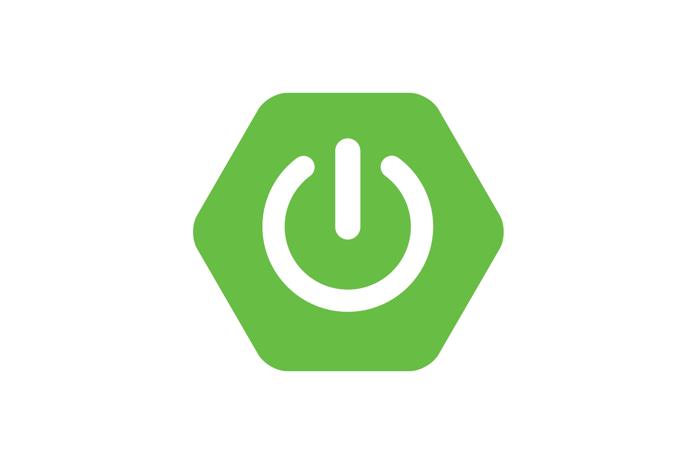
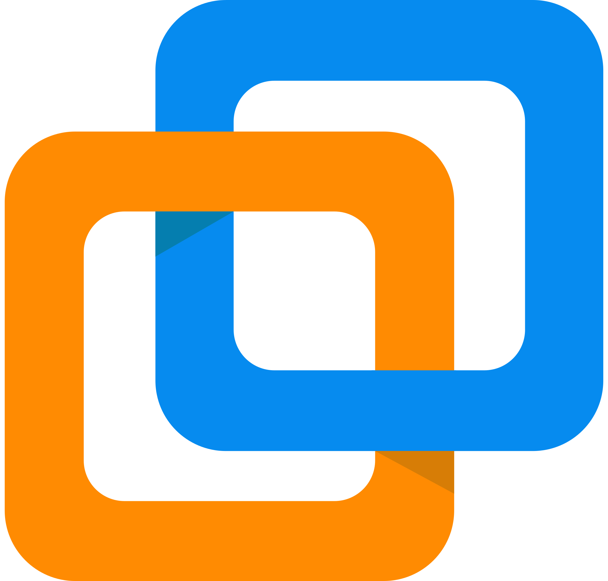

 
  

<!---

  

-->

  

<h1 align="center">
    
</h1>
<h4>I'm a passionate Full Stack Developer from Belgium 🇧🇪 who turns caffeine into clean code. I love bringing ideas to life through code and jumping into projects to help others build awesome things! 🚀</h4>

- 🌱 I’m currently learning **[Java Spring Boot](https://spring.io/projects/spring-boot)**
- 💬 Ask me about **Java, PostGreSQL...or anything [here](https://github.com/LucaClrk/LucaClrk/issues)**

 

  
  
  

## 🚀 Featured Projects

### 💻 [Calibration Application](https://lucaclrk.github.io/projects/calibration-application/)
*The calibration application is an app I made for Advionics NV. This application is a full stack program using PostgreSQL as a database, Python in the backend and mainly HTML for the front-end.*
* **Stack:** Python, HTML, JavaScript, Flask, Ginja, PostgreSQL, Docker, Jenkins
* **Key Feature:** A fully working application build from zero

### 🌐 [Music Light Tile](https://github.com/vives-project-xp/MusicLightTiles)
*A tile that lights up and plays sound when stood upon. From the 3D design to support an 80kg person to the MQTT broker to control the tile through a server. All is explained in the GitHub repository.*
* **Stack:** Python, C++
* **Key Feature:** The combination of software and hardware

## ⚡️ Stats

 

  <!-- Unified Core GitHub Stats -->
  
  
  <!-- Unified Streak Stats -->
  
  
    
  
  <!-- Unified Most Used Languages -->
  

### 🛠️ Tech Stack & Tools

| Category | Technologies |
| :--- | :--- |
| **Languages & Backend** |      |
| **Frameworks & Frontend** |        |
| **DevOps & Tools** |       |

## 🐍 My Contributions

  <picture>
    <source media="(prefers-color-scheme: dark)" srcset="https://raw.githubusercontent.com/LucaClrk/LucaClrk/output/github-contribution-grid-snake-dark.svg" />
    <source media="(prefers-color-scheme: light)" srcset="https://raw.githubusercontent.com/LucaClrk/LucaClrk/output/github-contribution-grid-snake.svg" />
    
  </picture>

